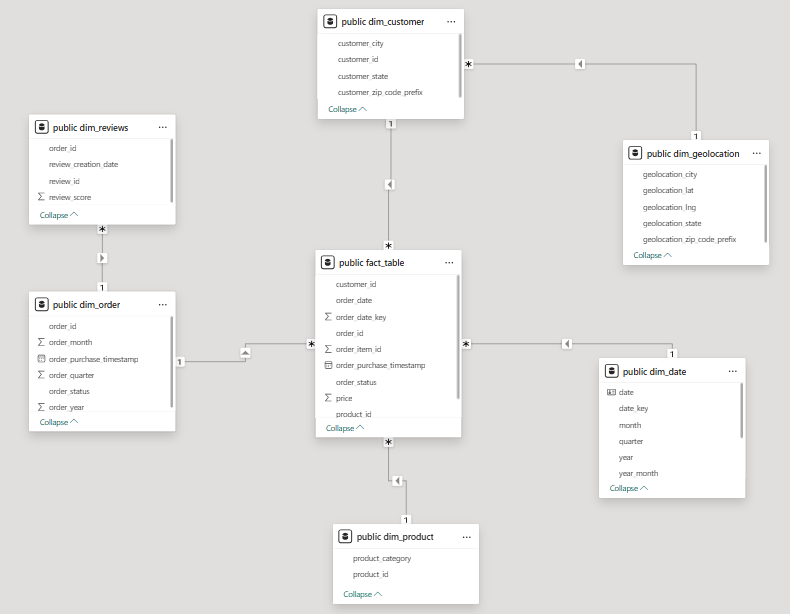
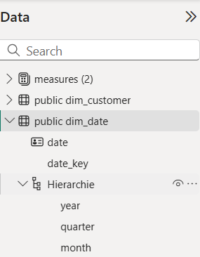

# Projektdokumentation Olist Datensatz

## Inhaltsverzeichnis
- [1. Kurzvorstellung Olist](#1-kurzvorstellung-olist)
- [2. Datensatzbeschreibung](#2-datensatzbeschreibung)

## 1. Kurzvorstellung Olist

Olist ist ein brasilianisches E-Commerce-Unternehmen, das als Marktplatzplattform für kleine und mittelständische Händler fungiert. 
Anstatt selbst Waren zu verkaufen, ermöglicht Olist externen Händlern, ihre Produkte über ihren Online-Markttplatz anzubieten. 
Olist übernimmt dabei zentrale Aufgaben wie Produktlistung, Marketing, Zahlungsabwicklung, Logistik und Kundenservice. 
Für Händler entsteht dadurch ein vereinfachter Zugang zum brasilianischen Online-Handel.

## 2. Datensatzbeschreibung

**Quelle:**  
Der Datensatz stammt von [Kaggle](https://www.kaggle.com/datasets/olistbr/brazilian-ecommerce) und wurde von Olist zur Verfügung gestellt.  

**Größe:**  
- 9 Tabellen  
- > 100.000 Bestellungen (Zeitraum: 2016–2018)  
- mehrere Millionen Zeilen insgesamt  

**Datenbereiche:**  
- **Bestellungen** (Auftrags-IDs, Zeitstempel, Status)  
- **Produkte** (Kategorie, Preis, Maße, Gewicht)  
- **Kunden & Geodaten** (PLZ, Stadt, Bundesstaat)  

**Eignung des Datensatzes:**  
Der Olist-Datensatz ist für Analyse- und BI-Projekte besonders geeignet, da er:  
- **umfangreich** ist mit einer umfangreich großen Datenmenge,  
- **realistische Geschäftsprozesse** eines Online-Marktplatzes abbildet,  
- **vielfältige Dimensionen** enthält (Zeit, Region, Produkt, Kunde, Umsatz),  
- und sich daher ideal für **SQL-Datenmodellierung** sowie die **Erstellung interaktiver Dashboards** eignet.

## 3. Problemidentifikation & Zielsetzung

Die reinen Rohdaten von Olist sind umfangreich, aber für Stakeholder schwer direkt zu interpretieren.  
Besonders für Entscheidungsträger in Marketing und Produktmanagement fehlen schnelle und visuelle Zugänge zu zentralen Fragestellungen.  
Um datenbasierte Entscheidungen treffen zu können, müssen die Daten aufbereitet und in verständlicher Form dargestellt werden.

### Zentrale Business-Fragen*
1. **Wie entwickeln sich Umsatz, Bestellungen und der durchschnittliche Bestellwert über die Zeit?**  
2. **Welche Produkte und Kategorien sind die Haupttreiber von Umsatz und Bestellungen?**  
3. **In welchen Städten und Regionen konzentriert sich die Nachfrage am stärksten?**

### Abgeleitete Dashboards
Um diese Fragen zu beantworten, wurden drei Dashboards entwickelt:

| Problem | Ziel | Dashboard | Wichtige KPIs |
|---------|------|-----------|---------------|
| Kein Überblick über Umsatz- und Bestellentwicklung | Entwicklung von Umsatz, Bestellungen und Durchschnittlicher Bestellwert (AOV) sichtbar machen | **Sales Overview Dashboard** | Revenue, Orders, AOV, Wachstumsraten (MoM/YoY) |
| Unklare Performance von Produktkategorien | Umsatztreiber und Potenziale identifizieren | **Product Analysis Dashboard** | Umsatz je Kategorie, Orders je Kategorie, AOV, Top-Produkte |
| Unklare regionale Nachfrage-Hotspots | Wichtigste Städte/Regionen für Umsatz hervorheben | **Regional Demand Dashboard (Hotspots)** | Umsatz nach Stadt, Umsatzanteile, Orders, AOV |

### * Dieses Projekt konzentriert sich auf den Zeitraum 2017, da dies das einzige vollständige Jahr im Datensatz ist.

## 4. Methodik / Vorgehen

Die CSV files wurden in Datenbank-Management-Tool DBeaver geladen. In dieser Umgebung wurden die nötigen SQL-Abfrgen geschrieben.

### 4.1 Datenaufbereitung in SQL

### Datenqualitätsprüfung

- Prüfung auf **NULL-Werte** in `order_id` (Primärschlüssel) und `customer_id` (Fremdschlüssel) im Orders-Datensatz
- Betroffene Zeilen wurden entfernt  
- Analyse der **Kundenaktivität**: Alle Kunden haben nur **eine Bestellung** aufgegeben  
- Beispiel-SQL-Abfrage siehe unten

Beispielhafte SQL-Abfrage:

```sql

/* Check 3: check if customers exist in dataset that had multiple orders */
select
    customer_id,
    count(*) as order_count
from vw_orders_clean
group by customer_id
having count(*) > 1
order by order_count desc;

```

Weitere SQL-Abfragen im Bereich Datenqualitätsprüfung können hier eingesehen werden:  
👉 [SQL Data Quality Checks](https://github.com/ScherbFloris/ecommerce-sql-powerbi-portfolio/blob/main/sql/data_quality_checks.sql)

### Aufbereitung von Fact-Tabelle und Dim-Tabellen

Für Power BI wurde ein **Sternschema** modelliert, damit Abfragen performant und eindeutig filterbar sind.

**Fakten:**
- `fact_table` (order_id, customer_id, price...)

SQL-Abfrage:

```sql

create or replace view fact_table as
select
  -- Primary key
    ood.order_id,
  
  -- Foreign keys (link to dimensions)                            
    ood.customer_id,
    ooid.seller_id,                                  
    opd.product_id,
    oord.review_id,
  
  -- Time attributes
    ood.order_purchase_timestamp::timestamp as order_purchase_timestamp, -- key for date dimension
    ood.order_purchase_timestamp::date as order_date,
    to_char(ood.order_purchase_timestamp::date,'YYYYMMDD')::int as order_date_key,
  
  -- Measure
    ooid.price
  
from olist_orders_dataset as ood
join olist_order_items_dataset as ooid on ood.order_id = ooid.order_id
join olist_products_dataset as opd  on ooid.product_id = opd.product_id
left join olist_order_reviews_dataset as oord on ood.order_id = oord.order_id
where ood.order_purchase_timestamp::date > '2016-12-31'; -- exclude incomplete year 2016

```

**Dimensionen (6):**
- `dim_order` (order_id, order_year, order_quarter, order_month, ...)
- `dim_reviews` (review_id, review_score, ...)
- `dim_customer` (customer_id, customer_city, ...)
- `dim_geolocation` (geolocation_zip_code_prefix, geolocation_lat, geolocation_lng, ...)
- `dim_product` (product_id, product_category, ...)
- `dim_date` (date, year, quarter, month, ...)

Beispielhafte SQL-Abfrage:

```sql

create or replace view dim_product AS
  
select distinct
  -- Primary key
  ooid.product_id,

  -- Product category
  pcnt.product_category_name_english AS product_category
  
from
    olist_products_dataset as opd
inner join product_category_name_translation as pcnt 
    on opd.product_category_name = pcnt.product_category_name
inner join olist_order_items_dataset as ooid
    on opd.product_id = ooid.product_id
order by
	product_id desc;

-- Preview rows
select *
from dim_product

```

Weitere SQL-Abfragen im Bereich Fact-Tabelle und Dim-Tabellen können hier eingesehen werden:  
👉 [SQL Data Quality Checks](https://github.com/ScherbFloris/ecommerce-sql-powerbi-portfolio/blob/main/sql/dim_fact_views.sql)

### 4.2 Datenmodellierung in PowerBI

Nachdem die SQL-Views erstellt wurden, wurden sie aus der PostgreSQL-Datenbank in Power BI importiert und zu einem Sternschema modelliert. Die Beziehungen sind 1:*; die Dimensionstabellen stehen auf der „1“-Seite, die Faktentabelle auf der „*“-Seite. 

Ausnahmen Gelten für die Dim-Reviews & Dim-Geolocation Tabellen. Direkter Link zur Faktentabelle erzeugt n:n und ambiguen Filterpfad. Deshalb Beziehung `dim_geolocation → dim_customer → fact` & `dim_reviews → dim_order → fact`.



Des Weiteren wurde in der dim_date Tabelle eine Datumhierarchie festgelegt.



## 5. Ergebnisse (Dashboards)

### 5.1 Sales Overiew Dashboard

### 5.2 Product Analysis Dashboard

### 5.3 Regional Hotspot Analysis

# 6. Empfehlugnen

# 7. Ausblick


