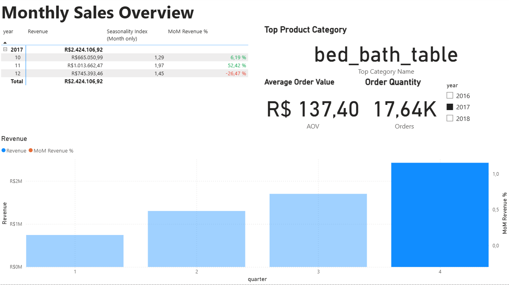

# Projektdokumentation Olist Datensatz

## Inhaltsverzeichnis
- [1. Kurzvorstellung Olist](#1-kurzvorstellung-olist)
- [2. Datensatzbeschreibung](#2-datensatzbeschreibung)
- [3. Problemidentifikation & Zielsetzung](#3-problemidentifikation--zielsetzung)
- [4. Methodik / Vorgehen](#4-methodik--vorgehen)
  - [4.1 Datenaufbereitung in SQL](#41-datenaufbereitung-in-sql)
  - [4.2 Datenmodellierung in PowerBI](#41-datenmodellierung-in-powerbi)
- [5. Ergebnisse (Dashboards)](#5-ergebnisse-dashboards)
	- [5.1 Sales Overview Dashboard](#51-sales-overview-dashboard)
  		- [5.1.1 Definierte & Verwendete DAX-Measures [exemplarisch]](#511-definierte--verwendete-dax-measures-exemplarisch)
    - [5.2 Product Analysis Dashboard](#52-product-analysis-dashboard)
    - [5.3 Regional Premium Hotspot Dashboard](#53-regional-premium-hotspot-dashboard) 
- [6. Handlungsempfehlungen](#6-handlungsempfehlungen)
	-  [6.1 Halten & Target Marketing](#61-halten--target-marketing)
  	-  [6.2 Geo-Conversion-Offensive](#62-geo--conversion--offensive)
  	-  [6.3 Cross- & Up-Selling](#63-cross---up-selling)


## 1. Kurzvorstellung Olist

Olist ist ein brasilianisches E-Commerce-Unternehmen, das als Marktplatzplattform für kleine und mittelständische Händler fungiert. 
Anstatt selbst Waren zu verkaufen, ermöglicht Olist externen Händlern, ihre Produkte über ihren Online-Markttplatz anzubieten. 
Olist übernimmt dabei zentrale Aufgaben wie Produktlistung, Marketing, Zahlungsabwicklung, Logistik und Kundenservice. 
Für Händler entsteht dadurch ein vereinfachter Zugang zum brasilianischen Online-Handel.

## 2. Datensatzbeschreibung

**Quelle:**  
Der Datensatz stammt von [Kaggle](https://www.kaggle.com/datasets/olistbr/brazilian-ecommerce) und wurde von Olist zur Verfügung gestellt.  

**Größe:**  
- 9 Tabellen  
- > 100.000 Bestellungen (Zeitraum: 2016–2018)  
- mehrere Millionen Zeilen insgesamt  

**Datenbereiche:**  
- **Bestellungen** (Auftrags-IDs, Zeitstempel, Status)  
- **Produkte** (Kategorie, Preis, Maße, Gewicht)  
- **Kunden & Geodaten** (PLZ, Stadt, Bundesstaat)  

**Eignung des Datensatzes:**  
Der Olist-Datensatz ist für Analyse- und BI-Projekte besonders geeignet, da er:  
- **umfangreich** ist mit einer umfangreich großen Datenmenge,  
- **realistische Geschäftsprozesse** eines Online-Marktplatzes abbildet,  
- **vielfältige Dimensionen** enthält (Zeit, Region, Produkt, Kunde, Umsatz),  
- und sich daher ideal für **SQL-Datenmodellierung** sowie die **Erstellung interaktiver Dashboards** eignet.

## 3. Problemidentifikation & Zielsetzung

Die reinen Rohdaten von Olist sind umfangreich, aber für Stakeholder schwer direkt zu interpretieren.  
Besonders für Entscheidungsträger in Marketing und Produktmanagement fehlen schnelle und visuelle Zugänge zu zentralen Fragestellungen.  
Um datenbasierte Entscheidungen treffen zu können, müssen die Daten aufbereitet und in verständlicher Form dargestellt werden.

### Zentrale Business-Fragen*
1. **Wie entwickeln sich Umsatz, Bestellungen und der durchschnittliche Bestellwert über die Zeit?**  
2. **Welche Produkte und Kategorien sind die Haupttreiber von Umsatz und Bestellungen?**  
3. **In welchen Städten und Regionen konzentriert sich die Nachfrage am stärksten?**

### Abgeleitete Dashboards
Um diese Fragen zu beantworten, wurden drei Dashboards entwickelt:

| Problem | Ziel | Dashboard | Wichtige KPIs |
|---------|------|-----------|---------------|
| Kein Überblick über Umsatz- und Bestellentwicklung | Entwicklung von Umsatz, Bestellungen und Durchschnittlicher Bestellwert (AOV) sichtbar machen | **Sales Overview Dashboard** | Umsatz, Bestellungen, Durchschnittlicher Bestellwert, Umsatz Wachstumsraten (MoM), Top Produktkategorie, Saisonalitätsindex |
| Unklare Performance von Produktkategorien | Umsatztreiber und Potenziale identifizieren | **Product Analysis Dashboard** | Umsatz je Kategorie, Orders je Kategorie, AOV, Top-Produkte |
| Unklare regionale Nachfrage-Hotspots | Wichtigste Städte/Regionen für Umsatz hervorheben | **Regional Demand Dashboard (Hotspots)** | Umsatz nach Stadt, Umsatzanteile, Orders, AOV |

### * Dieses Projekt konzentriert sich auf den Zeitraum 2017, da dies das einzige vollständige Jahr im Datensatz ist.

## 4. Methodik / Vorgehen

Die CSV files wurden in Datenbank-Management-Tool DBeaver geladen. In dieser Umgebung wurden die nötigen SQL-Abfrgen geschrieben.

### 4.1 Datenaufbereitung in SQL

### Datenqualitätsprüfung

- Prüfung auf **NULL-Werte** in `order_id` (Primärschlüssel) und `customer_id` (Fremdschlüssel) im Orders-Datensatz.
- Betroffene Zeilen wurden entfernt.
- Analyse der **Kundenaktivität**: Alle Kunden haben nur **eine Bestellung** aufgegeben.
- Weitere Datentransformation in PowerBI Power Query ist durch die SQL Vorarbeit nicht nötig.
- Beispiel-SQL-Abfrage siehe unten.

Beispielhafte SQL-Abfrage:

```sql

/* Check 3: check if customers exist in dataset that had multiple orders */
select
    customer_id,
    count(*) as order_count
from vw_orders_clean
group by customer_id
having count(*) > 1
order by order_count desc;

```

Weitere SQL-Abfragen im Bereich Datenqualitätsprüfung können hier eingesehen werden:  
👉 [SQL Data Quality Checks](https://github.com/ScherbFloris/ecommerce-sql-powerbi-portfolio/blob/main/sql/data_quality_checks.sql)

### Aufbereitung von Fact-Tabelle und Dim-Tabellen

Für Power BI wurde ein **Sternschema** modelliert, damit Abfragen performant und eindeutig filterbar sind.

**Fakten:**
- `fact_table` (order_id, customer_id, price...)

SQL-Abfrage:

```sql

create or replace view fact_table as
select
  -- Primary key
    ood.order_id,
  
  -- Foreign keys (link to dimensions)                            
    ood.customer_id,
    ooid.seller_id,                                  
    opd.product_id,
    oord.review_id,
  
  -- Time attributes
    ood.order_purchase_timestamp::timestamp as order_purchase_timestamp, -- key for date dimension
    ood.order_purchase_timestamp::date as order_date,
    to_char(ood.order_purchase_timestamp::date,'YYYYMMDD')::int as order_date_key,
  
  -- Measure
    ooid.price
  
from olist_orders_dataset as ood
join olist_order_items_dataset as ooid on ood.order_id = ooid.order_id
join olist_products_dataset as opd  on ooid.product_id = opd.product_id
left join olist_order_reviews_dataset as oord on ood.order_id = oord.order_id
where ood.order_purchase_timestamp::date > '2016-12-31'; -- exclude incomplete year 2016

```

**Dimensionen (6):**
- `dim_order` (order_id, order_year, order_quarter, order_month, ...)
- `dim_reviews` (review_id, review_score, ...)
- `dim_customer` (customer_id, customer_city, ...)
- `dim_geolocation` (geolocation_zip_code_prefix, geolocation_lat, geolocation_lng, ...)
- `dim_product` (product_id, product_category, ...)
- `dim_date` (date, year, quarter, month, ...)

Beispielhafte SQL-Abfrage:

```sql

create or replace view dim_product AS
  
select distinct
  -- Primary key
  ooid.product_id,

  -- Product category
  pcnt.product_category_name_english AS product_category
  
from
    olist_products_dataset as opd
inner join product_category_name_translation as pcnt 
    on opd.product_category_name = pcnt.product_category_name
inner join olist_order_items_dataset as ooid
    on opd.product_id = ooid.product_id
order by
	product_id desc;

-- Preview rows
select *
from dim_product

```

```sql
CREATE OR REPLACE VIEW dim_date AS
WITH src AS (
  SELECT TO_TIMESTAMP(NULLIF(order_purchase_timestamp, ''), 'YYYY-MM-DD HH24:MI:SS') AS ts
  FROM olist_orders_dataset
  WHERE NULLIF(order_purchase_timestamp, '') IS NOT NULL
),
bounds AS (
  SELECT MIN(ts)::date AS dmin, MAX(ts)::date AS dmax FROM src
),
series AS (
  SELECT generate_series(dmin, dmax, '1 day')::date AS d FROM bounds
)
SELECT
  d                         AS date,
  TO_CHAR(d,'YYYYMMDD')::int AS date_key,
  EXTRACT(YEAR FROM d)::int  AS year,
  EXTRACT(QUARTER FROM d)::int AS quarter,
  EXTRACT(MONTH FROM d)::int AS month,
  TO_CHAR(d,'YYYY-MM')       AS year_month
FROM series
ORDER BY d;
```

**Weitere SQL-Abfragen im Bereich Fact-Tabelle und Dim-Tabellen können hier eingesehen werden:**
👉 [SQL Data Quality Checks](https://github.com/ScherbFloris/ecommerce-sql-powerbi-portfolio/blob/main/sql/dim_fact_views.sql)

### 4.2 Datenmodellierung in PowerBI

Nachdem die SQL-Views erstellt wurden, wurden sie aus der PostgreSQL-Datenbank in Power BI importiert und zu einem Sternschema modelliert. Die Beziehungen sind 1:*; die Dimensionstabellen stehen auf der „1“-Seite, die Faktentabelle auf der „*“-Seite. 

Ausnahmen Gelten für die Dim-Reviews & Dim-Geolocation Tabellen. Direkter Link zur Faktentabelle erzeugt n:n und ambiguen Filterpfad. Deshalb Beziehung `dim_geolocation → dim_customer → fact` & `dim_reviews → dim_order → fact`.


Des Weiteren wurde in der dim_date Tabelle eine Datumhierarchie festgelegt.


## 5. Ergebnisse (Dashboards)

### 5.1 Sales Overview Dashboard


- **Gesamtjahresumsatz:** 2017 wurde ein Umsatz von **R$ 6.172.009,91** erzielt.
- **Top Product Category (Meist Verkaufte Produktkategorie):** Die meistverkaufte Kategorie 2017 war **bed_bath_table**.
- **Order Quantity (Gesamtzahl an Bestellungen)**: 2017 wurden insgesamt **44.580** Bestellungen getätigt.
- **AOV (Durchschnittlicher Bestellwert):** Der durchschnittliche Bestellwert lag 2017 bei **R$ 138,45** (pro Bestellung).
- **MoM Revenue %% (Monatliche Monatswachstumsrate):** In **9 von 11** Monaten stieg der Umsatz gegenüber dem Vormonat. Von **Juni bis November 2017** wuchs der Umsatz durchgehend.



**Bei genauerer Betrachtung sehen wir das erfolgreichste Quartal**

- **Erfolgreichstes Quartal (Q4):** Der Quartalsumsatz lag bei **$R 2.424.106,92**.
- **Saisonalitätsindex:** **Oktober, November und Dezember 2017** verzeichneten die höchsten Umsätze – vermutlich aufgrund des Weihnachtsgeschäfts.

#### 5.1.1 Definierte & Verwendete DAX-Measures [exemplarisch]

**DAX-Measure MoM Revenue %**

```dax
Avg Monthly Revenue (Same Year) = 
VAR y =
    SELECTEDVALUE('public dim_date'[Year])
VAR monthly =
    SUMMARIZE(
        FILTER(ALL('public dim_date'); 'public dim_date'[Year] = y);
        'public dim_date'[Year];
        'public dim_date'[month];        -- ggf. an deine Monats-Spalte anpassen
        "Rev"; CALCULATE([Revenue])
    )
RETURN
IF( ISBLANK(y); BLANK(); AVERAGEX(monthly; [Rev]) )
```

**Seasonality Index**

```dax
Seasonality Index (Month only) = 
IF(
    HASONEVALUE('public dim_date'[month]);
    DIVIDE([Revenue]; [Avg Monthly Revenue (Same Year)]);
    BLANK()
)
```
**Weitere definierte DAX-Measures können hier eingesehen werden:**
👉 [SQL Data Quality Checks](https://github.com/ScherbFloris/ecommerce-sql-powerbi-portfolio/blob/main/sql/dim_fact_views.sql)

### 5.2 Product Analysis Dashboard


- Pareto (80 %) Produktkategorien: 16 von über 120 verschiedenen Produktkategorien erwirtschaften 80 % des Umsatzes im Jahr 2017.
- 35 000 Bestellungen [von insgesamt 45 000 Bestellungen] entfallen auf diese Produktkategorien.
- Einge wenige Produktkategorien bringen mehr als 5 % des Jahresumsatzes [bed_bath_table, watches_gifts, health_beauty, sports_leisure, computer_asscessorie, cool_stuff & furniture_decore].
- Da wir wissen, dass Kunden bei Olist einmalig Einkaufen, lohnt es sich im nächsten Schritt sich auf die Kunden zu konzentrieren, die einen überdurchschnittlich hohen Warenbestellwert (AOV > 1).


- Zwei Produktkategorien sind besonders interessant: computers & watches_gifts.
- Diese Produktkategorien sind oberhalb der Trendlinie, also verhältnismäßig wenige Bestellungen, mit hohen Umsatzanteil. Wobei die Kategorie computers mit einem AOV-Index von 9,35 besonders hervorzuheben ist. Bedeutet: in der Kategorie computers ist der der durschnittliche Warenbestellwert 9,35 mal höher als der durschnlitliche Bestellwert!
- Desweieren kann man erkennen, dass die Kategorie health_beauty unterhalb der Trendlinie somit diese Kategorie durch viele Bestellungen zu einem Umsattzanteil von 7,83 % beiträgt.

### 5.3 Regional Hotspot Analysis

- Im nächsten Schritt konzentrieren wir unsere Analyse auf die Produktkategorien die einen überdurchschnittlichen Warenbestellwert von AOV > 1 vorweisen [computers, auto, cool_stuff, office_furniture & watches_gifts].
- Zusätzlich konzentireren wir uns, wo sich diese Premiumprodukte geografisch in den 20 relevantesten Städte, die 35,29 % des Olist Gesamtumsatzes innerhalb der primium Produktkategorien konzentrieren.


- Die 20 relevantesten Städte befinden sich alle in Brasilien, wobei sich der großteil der durch den verkauften Premiumprodukte in und um Sao Paulo befindet
- **Im nächsten Schritt, stellt sich die Frage, durch welche verkaufsfördernde Maßnamen weitere premium Produkte verkauft werden können.**
- **Dabei werden nun im nächsten Schritt die Städte im Scatter-Plot identifiziert, die über / bzw. unterdurchschnittliche Order und AOV vorweißen**


- Städte die eine **überdurchschnittlich hohe AVO und Bestellzahl** haben sind: Guarulhos, Campinas, Salvador, Curtiba & Rio de Janeiro.
- Auffällig ist, dass in diesen Städten insbesondere Produkte von der Produktkategorie watches_gifts gekauft werden.


- Städte die eine **unterdurchschnittlich hohe AVO** und eine **überdurchschnittliche Bestellmenge** haben sind: Fortaleza, Porto Alegre, Brasilia, Belo Horizonte & Sao Paolo.
- In diesen Städten werden vorallem Premiumprodukte der Kategorie auto, cool_stuff und watches_gifts verkauft.


- Städte die eine **überdurchschnittlich hohe AVO** und eine **unterdurchschnittliche Bestellmenge** haben sind: Gioania, Bauru, Londrina, Juiz de Fora, Mogi das Cruzes, Recife & Sao Jose dos Campos.
- In diesen Städten werden insbesondere Produkte aus der Produktkategorie cool_stuff und watches_gifts gekauft.

# 6. Handlungsempfehlungen

- In einer 2 x 2 Matrix dargestellt, ergeben sich drei Quadranten in denen folgende Handlungsempfehlungen abgeleitet werden:

|                 | **Niedrige Bestellmenge**             | **Hohe Bestellmenge**          |
|-----------------|-----------------------------|------------------------------|
| **Hoher AOV**   | **Regionales Geo-Conversion-Offensive** | **Regionales Halten & Target Marketing**         |
| **Niedriger AOV** |                          | **Regionales Cross- & Up-Selling**      |

## 6.1 Halten & Target Marketing 

**Best-Case**
**These:** Kunden sind kaufkräftig und kaufen oft. Die Strategie muss sein die Kundenbindung zu sichern & den Bestellwert zu stabilisieren.

## **Handlungsempfehlungen:**

1. Regional die Kundenbindung ausbauen
   - Wie eingangs erwähnst, kaufen Bestellen die Kunden bei Olist einmal.
   - Bei diesem Segment ist es daher wichtig, die Kunden in den Regionen Guarulhos, Campinas, Salvador, Curtiba & Rio de Janeiro zu reaktivieren und zum erneuten Einkaufen auf Olist zu bewegen.
2. Target Marketing:
   - Kunden aus diesen Regionen individuelle Angebote basierend auf ihren letzten Einkauf zukommen lassen.
   - Diesen Kunden dabei einen kostenlosen Versand anbieten.
3. VIP-Mitgliedschaft:
   - Längerfristig wäre eine Mitgliedschaft für diese Kunden denkbar, die längerfristig von für sie eingeschränkte Sonderaktionen profitieren können.

## 6.2 Geo-Conversion-Offensiv

**Problem:** In einigen Städten ist der durchschnittliche Bestellwert hoch, die Bestellmenge aber niedrig.
**These:** Es fehlt an gezielter regionaler Sichtbarkeit und ein reibungsloser Kaufabschluss; Preisnachlässe sind nicht nötig.

## **Handlungsempfehlungen:**

1. Regionale Landingpage einführen
   - In Gioania, Bauru, Londrina, Juiz de Fora, Mogi das Cruzes, Recife & Sao Jose dos Campos Landing Pages einführen.
   - Die Lieferzeit für diese Städte einfacherer sichtbar machen: "Lieferung nach 'Gioania' in 1 - 2 Werktage".
   - Kostenlose Retouren anbieten
2. Schwellenanreize setzen
   - In diesen Städten einen kostenlosen Versand knapp über dem regionalen AOV-Median anbieten und klar kommunizieren:
   - Z.B. "Nur noch Betrag X für einen Kostenlosen Versand nach Stadt 'Gioania'"
   
## 6.3 Cross- & Up-Selling

**Problem:** In einigen Städten ist der durchschnittliche Bestellwert niedrig, die Bestellmenge aber hoch.
**These:** Die Produkte sind beliebt und häufig gekauft, aber die Käufer legen den Fokus auf Preis oder kleine Warenkörbe.

## **Handlungsempfehlungen:**

1. Regionale  Cross- & Up-Selling Maßnahmen
   - Innerhalb bestimmter Produktkategorien z.B. watches_gifts Regionale Angebote in den Regionen In den Regionen Fortaleza, Porto Alegre, Brasilia, Belo Horizonte & Sao Paolo anpassen.
   - Cross-Selling: Uhren Einzeln und Uhren mit Pflegeset oder einem edlen Uhr-Armband anbieten.
   - Up-Selling: personalisierungen der Geschenke und Uhren anbieten wie z.B. Gravuren (Up-Selling)
  


