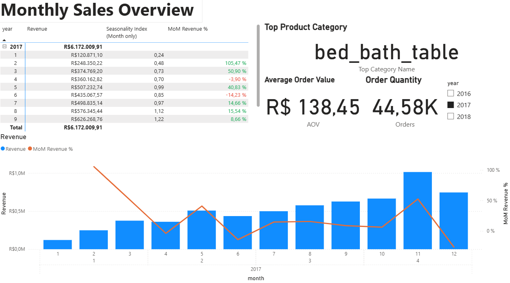
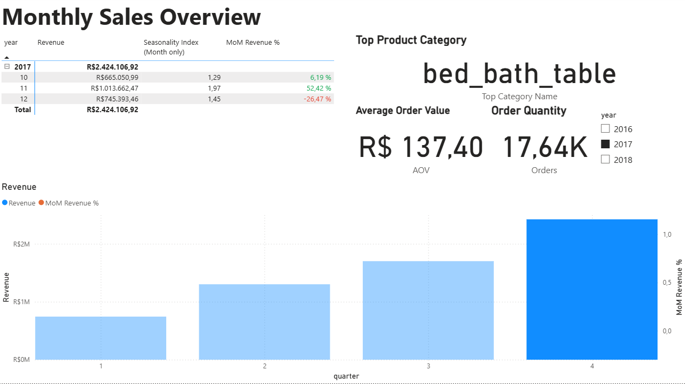
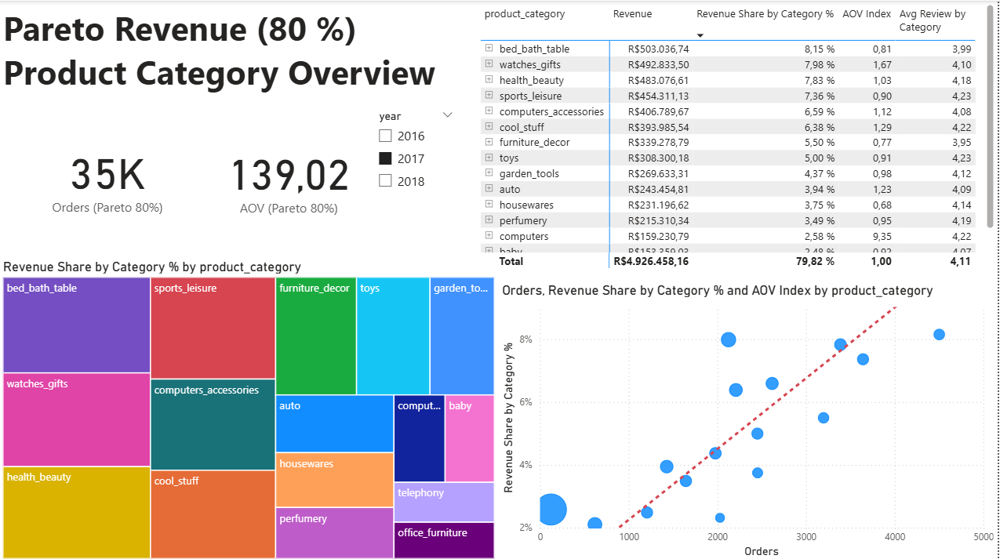
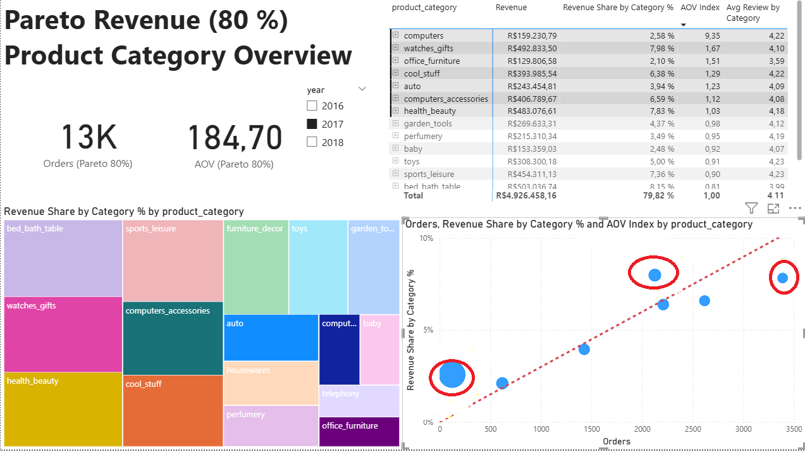
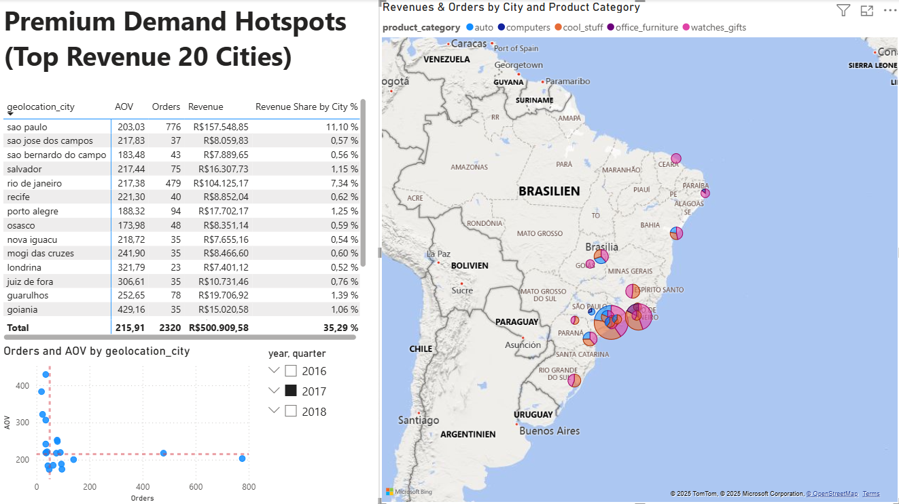
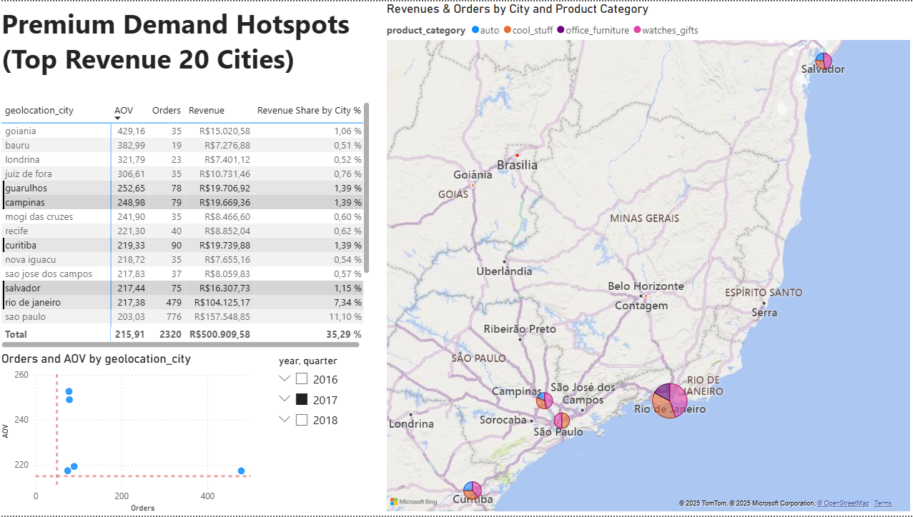
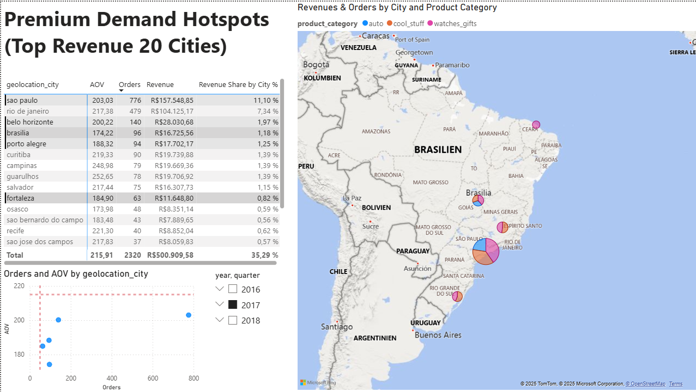
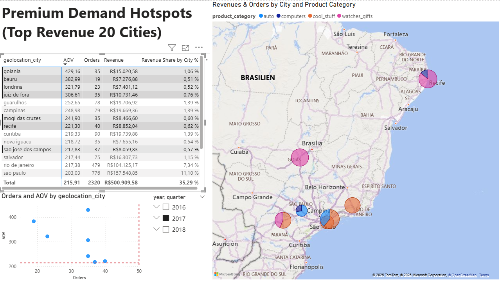

# Project Documentation Olist Dataset

## Inhaltsverzeichnis
- [1. Brief Introduction to Olist](#1-brief-introduction-to-olist)
- [2. Dataset Description](#2-dataset-description)
- [3. Problem Identification & Objectives](#3-problem-identification-&-objectives)
- [4. Methodology / Approach](#4-methodology-/-approach)
  - [4.1 Data Preparation in SQL](#41-data-preparation-in-SQL)
  - [4.2 Data Modeling in Power BI](#41-data-modeling-in-power-bi)
- [5. Results (Dashboards)](#5-results-dashboards)
	- [5.1 Sales Overview Dashboard](#51-sales-overview-dashboard)
  		- [5.1.1 Defined & Used DAX Measures (examples)](#511-defined-&-used-dax-measures-(examples))
    - [5.2 Product Analysis Dashboard](#52-product-analysis-dashboard)
    - [5.3 Regional Premium Hotspot Dashboard](#53-regional-premium-hotspot-dashboard) 
- [6. Recommendationsn](#6-recommendations)
	-  [6.1 Halten & Target Marketing](#61-halten--target-marketing)
  	-  [6.2 Geo-Conversion-Offensiv](#62-geo-conversion-offensiv)
  	-  [6.3 Cross- & Up-Selling](#63-cross---up-selling)


## 1. Brief Introduction to Olist

Olist is a Brazilian e-commerce company that operates a marketplace platform for small and medium-sized merchants. Instead of selling goods itself, Olist enables external sellers to list their products on its online marketplace. Olist handles key functions such as product listing, marketing, payment processing, logistics, and customer service. This gives merchants a simplified entry into Brazil’s online retail market.

## 2. Dataset Description

**Quelle:**  
The dataset comes from [Kaggle](https://www.kaggle.com/datasets/olistbr/brazilian-ecommerce) and was provided by Olist.  

**Size:**  

- 9 tables
- 100,000 orders (period: 2016–2018)
- several million rows in total  

**Data Groups:**  
- **Orders** (order IDs, timestamps, status)
- **Products** (category, price, dimensions, weight)
- **Customers & Geodata** (ZIP code, city, state)

**Why this dataset is suitable:**

The Olist dataset is well-suited for analytics and BI projects because it:

- is **large-scale** with substantial data volume,
- reflects realistic business processes of an online marketplace,
- offers **diverse dimensions** (time, region, product, customer, revenue),
- and **is ideal for SQL data modeling and building interactive dashboards.**

## 3. Problem Identification & Objectives

- Olist’s raw data is extensive but hard for stakeholders to interpret directly.
- Decision-makers in Marketing and Product Management lack quick, visual access to key questions.
- To enable data-driven decisions, the data must be prepared and presented in a clear, understandable form.

**Objective: Transform raw Olist data into actionable insights via a clean data model and intuitive dashboards that answer core business questions fast.**

### Core Business Questions

1. **How do revenue, orders, and average order value (AOV) evolve over time?**
2. **Which products and categories are the primary drivers of revenue and orders?**
3. **In which cities and regions is demand for premium product categories most concentrated?**
4. **What concrete actions can be taken to increase sales of these premium products?**

### Derived Dashboards

To answer the core business questions, three dashboards were built:

| Problem | Goal | Dashboard | Key KPIs |
|---|---|---|---|
| No clear view of revenue and order trends | Make revenue, orders, and Average Order Value (AOV) development visible | **Sales Overview Dashboard** | Revenue, Orders, AOV, Revenue Growth (MoM), Top Product Category, Seasonality Index |
| Unclear performance of product categories | Identify revenue drivers and opportunities | **Product Analysis Dashboard** | Revenue by Category, Orders by Category, AOV, Top Products |
| Unclear regional demand hotspots | Highlight top cities/regions for revenue within premium product categories | **Regional Premium Demand Dashboard (Hotspots)** | Revenue by City, Revenue Shares, Orders, AOV |

> **Note:** This project focuses on 2017, as it is the only complete year in the dataset.

## 4. Methodology / Approach

The CSV files were loaded into **DBeaver**. All **SQL preprocessing** (data quality checks, cleaning, and modeling) was done there. As a result, **no additional transformations** were required in Power BI (beyond data types and relationships).

### 4.1 Data Preparation in SQL

#### Data Quality Checks

- **NULL checks** on key columns (`order_id` as primary key, `customer_id` as foreign key) in the orders dataset.
- **Duplicate check** on `order_id`.
- **Customer activity:** In Olist, *most customers place only one order* — this is verified explicitly (not assumed).
- Creation of cleaned views/tables for direct consumption by Power BI.

**Example SQL (PostgreSQL-compatible):**

```sql

/* Check 3: check if customers exist in dataset that had multiple orders */
select
    customer_id,
    count(*) as order_count
from vw_orders_clean
group by customer_id
having count(*) > 1
order by order_count desc;

```

Further SQL queries for data quality checks can be found here: 
👉 [SQL Data Quality Checks](https://github.com/ScherbFloris/ecommerce-sql-powerbi-portfolio/blob/main/sql/data_quality_checks.sql)

### Aufbereitung von Fact-Tabelle und Dim-Tabellen

Für Power BI wurde ein **Sternschema** modelliert, damit Abfragen performant und eindeutig filterbar sind.

**Fakten:**
- `fact_table` (order_id, customer_id, price...)

SQL-Abfrage:

```sql

create or replace view fact_table as
select
  -- Primary key
    ood.order_id,
  
  -- Foreign keys (link to dimensions)                            
    ood.customer_id,
    ooid.seller_id,                                  
    opd.product_id,
    oord.review_id,
  
  -- Time attributes
    ood.order_purchase_timestamp::timestamp as order_purchase_timestamp, -- key for date dimension
    ood.order_purchase_timestamp::date as order_date,
    to_char(ood.order_purchase_timestamp::date,'YYYYMMDD')::int as order_date_key,
  
  -- Measure
    ooid.price
  
from olist_orders_dataset as ood
join olist_order_items_dataset as ooid on ood.order_id = ooid.order_id
join olist_products_dataset as opd  on ooid.product_id = opd.product_id
left join olist_order_reviews_dataset as oord on ood.order_id = oord.order_id
where ood.order_purchase_timestamp::date > '2016-12-31'; -- exclude incomplete year 2016

```

**Dimensionen (6):**
- `dim_order` (order_id, order_year, order_quarter, order_month, ...)
- `dim_reviews` (review_id, review_score, ...)
- `dim_customer` (customer_id, customer_city, ...)
- `dim_geolocation` (geolocation_zip_code_prefix, geolocation_lat, geolocation_lng, ...)
- `dim_product` (product_id, product_category, ...)
- `dim_date` (date, year, quarter, month, ...)

Beispielhafte SQL-Abfrage:

```sql

create or replace view dim_product AS
  
select distinct
  -- Primary key
  ooid.product_id,

  -- Product category
  pcnt.product_category_name_english AS product_category
  
from
    olist_products_dataset as opd
inner join product_category_name_translation as pcnt 
    on opd.product_category_name = pcnt.product_category_name
inner join olist_order_items_dataset as ooid
    on opd.product_id = ooid.product_id
order by
	product_id desc;

-- Preview rows
select *
from dim_product

```

```sql
CREATE OR REPLACE VIEW dim_date AS
WITH src AS (
  SELECT TO_TIMESTAMP(NULLIF(order_purchase_timestamp, ''), 'YYYY-MM-DD HH24:MI:SS') AS ts
  FROM olist_orders_dataset
  WHERE NULLIF(order_purchase_timestamp, '') IS NOT NULL
),
bounds AS (
  SELECT MIN(ts)::date AS dmin, MAX(ts)::date AS dmax FROM src
),
series AS (
  SELECT generate_series(dmin, dmax, '1 day')::date AS d FROM bounds
)
SELECT
  d                         AS date,
  TO_CHAR(d,'YYYYMMDD')::int AS date_key,
  EXTRACT(YEAR FROM d)::int  AS year,
  EXTRACT(QUARTER FROM d)::int AS quarter,
  EXTRACT(MONTH FROM d)::int AS month,
  TO_CHAR(d,'YYYY-MM')       AS year_month
FROM series
ORDER BY d;
```

**Further SQL queries for the fact table and dimension tables can be found here:**
👉 [SQL Data Quality Checks](https://github.com/ScherbFloris/ecommerce-sql-powerbi-portfolio/blob/main/sql/dim_fact_views.sql)

### 4.2 Data Modeling in Power BI

After creating the SQL views, they were imported from PostgreSQL into Power BI and modeled as a **star schema**.  
Relationships are **1:* (one-to-many)** with **dimensions on the “1” side** and the **fact table on the “*” side**. Cross-filtering is **single direction (Dim → Fact)** to avoid ambiguity.

**Exceptions (snowflake links to avoid M:M and ambiguous paths):**
- `dim_geolocation → dim_customer → fact`  
  *(Direct `dim_geolocation → fact` would create M:M and ambiguous filters.)*
- `dim_reviews → dim_order → fact`  
  *(Direct `dim_reviews → fact` would create M:M and ambiguous filters.)*

**Diagram (simplified):**


Additionally, a **date hierarchy** was defined in `dim_date` (Year → Quarter → Month → Day) and set as the default for visuals.  


## 5. Results (Dashboards)

### 5.1 Sales Overview Dashboard



- **Total annual revenue:** In 2017, revenue was **R$ 6.172.009,91**.
- **Top product category (most sold):** The most sold category in 2017 was **bed_bath_table**.
- **Order quantity (total number of orders):** In 2017, there were **44.580** orders.
- **AOV (Average Order Value):** The average order value in 2017 was **R$ 138,45** (per order).
- **MoM revenue (%) (month-over-month growth rate):** In **9 out of 11** months, revenue increased compared to the previous month. From **June to November 2017**, revenue grew continuously.



**On closer inspection, we see the best-performing quarter**

- **Best-performing quarter (Q4):** Quarterly revenue was **R$ 2.424.106,92**.
- **Seasonality index:** **October, November, and December 2017** recorded the highest revenues — likely driven by the holiday season.

#### 5.1.1 Defined & Used DAX Measures (examples)

**DAX-Measure MoM Revenue %**

```dax
Avg Monthly Revenue (Same Year) = 
VAR y =
    SELECTEDVALUE('public dim_date'[Year])
VAR monthly =
    SUMMARIZE(
        FILTER(ALL('public dim_date'); 'public dim_date'[Year] = y);
        'public dim_date'[Year];
        'public dim_date'[month];        -- ggf. an deine Monats-Spalte anpassen
        "Rev"; CALCULATE([Revenue])
    )
RETURN
IF( ISBLANK(y); BLANK(); AVERAGEX(monthly; [Rev]) )
```

**Seasonality Index**

```dax
Seasonality Index (Month only) = 
IF(
    HASONEVALUE('public dim_date'[month]);
    DIVIDE([Revenue]; [Avg Monthly Revenue (Same Year)]);
    BLANK()
)
```
**Further defined DAX measures can be found here:**
👉 [SQL Data Quality Checks](https://github.com/ScherbFloris/ecommerce-sql-powerbi-portfolio/blob/main/sql/dim_fact_views.sql)

### 5.2 Product Analysis Dashboard



- **Pareto (80%) product categories:** 16 out of 120+ different product categories generated **80% of 2017 revenue**.
- **35,000 orders** [out of a total of **45,000** orders] fall into these product categories.
- **A few categories contribute >5%** of annual revenue [**bed_bath_table**, **watches_gifts**, **health_beauty**, **sports_leisure**, **computer_asscessorie**, **cool_stuff**, **furniture_decore**].
- Since we know that customers on Olist purchase only once, the next step is to focus on customers with an **above-average order value (AOV > 1)**.



- **Two product categories stand out:** `computers` and `watches_gifts`.
- These categories sit **above the trend line** — **relatively few orders** but a **high revenue share**. The `computers` category is especially notable with an **AOV Index of 9.35**.  
  **Meaning:** in `computers`, the **average order value is 9.35× higher** than the overall average order value.
- **Additionally**, `health_beauty` lies **below the trend line** — many orders but contributing **7.83% of annual revenue**.

### 5.3 Regional Premium Hotspot Dashboard

- In the next step, we focus our analysis on product categories with an **above-average order value** (**AOV Index > 1**): [`computers`, `auto`, `cool_stuff`, `office_furniture`, `watches_gifts`].
- In addition, we examine the **spatial distribution** of these premium products across the **top 20 cities**. These cities account for **35.29%** of Olist’s **total revenue within premium product categories**.



- All 20 key cities are in Brazil. The majority of premium-product sales are concentrated in the Greater São Paulo area.
- **Next, we assess which sales promotions can further increase premium-product sales.**
- **Next, we flag in the scatter plot the cities with above- or below-average order counts and AOV.**



- Cities with **above-average AOV and order counts**: **Guarulhos, Campinas, Salvador, Curitiba, and Rio de Janeiro**.
- Notably, these cities predominantly purchase products from the **“watches_gifts”** category.



- Cities with **below-average AOV** and **above-average order volume**: **Fortaleza, Porto Alegre, Brasília, Belo Horizonte, and São Paulo**.
- In these cities, premium products are primarily from the **auto**, **cool_stuff**, and **watches_gifts** categories.



- Cities with **above-average AOV** and **below-average order volume**: **Goiânia, Bauru, Londrina, Juiz de Fora, Mogi das Cruzes, Recife, and São José dos Campos**.
- In these cities, purchases are concentrated in the **cool_stuff** and **watches_gifts** categories.

# 6. Recommendations

- Shown in a **2 × 2 matrix**, three quadrants yield the following recommended actions:

|                 | **Low order volume**                 | **High order volume**              |
|-----------------|--------------------------------------|------------------------------------|
| **High AOV**    | **Regional Geo-Conversion Offensive** | **Regional Retention & Targeted Marketing** |
| **Low AOV**     |                                      | **Regional Cross- & Up-Selling**   |

> Note: A 2×2 matrix has **four** quadrants. The cell **Low AOV × Low order volume** is currently unspecified. Typical options: awareness/market development, pricing/promo tests, or deprioritize.

## 6.1 Retention & Targeted Marketing

**Best case**  
**Hypothesis:** Customers are high-spending and purchase frequently. The strategy is to **secure retention** and **stabilize AOV**.

## **Recommendations**

1. **Expand regional customer retention**
   - As noted earlier, **most** Olist customers purchase only once.
   - Focus on **reactivating** customers in **Guarulhos, Campinas, Salvador, Curitiba, and Rio de Janeiro** to drive repeat purchases.

2. **Targeted marketing**
   - Send **personalized offers** to customers in these regions based on their last purchase.
   - Offer **free shipping** as an incentive for the next order.

3. **VIP membership**
   - Consider a **membership program** for these customers with exclusive, time-limited promotions to encourage loyalty.

---

## 6.2 Geo-Conversion Offensive

**Problem:** In some cities, **AOV is high** but **order volume is low**.  
**Hypothesis:** Lack of regional visibility and friction at checkout; **discounts not required**.

### Actions

1. **Regional landing pages**
   - Launch landing pages for **Goiânia, Bauru, Londrina, Juiz de Fora, Mogi das Cruzes, Recife, and São José dos Campos**.
   - Make delivery times clearly visible, e.g., _“Delivery to Goiânia in 1–2 business days.”_
   - Offer **free returns**.

2. **Threshold incentives**
   - Offer **free shipping** slightly **above the regional AOV median** and communicate it clearly:
   - e.g., _“Only R$ X more for free shipping to Goiânia.”_

---

## 6.3 Cross- & Up-Selling

**Problem:** In some cities, **AOV is low** but **order volume is high**.  
**Hypothesis:** Products are popular and frequently purchased, but buyers focus on price or keep baskets small.

### Actions

1. **Regional cross- & up-selling**
   - For categories like **watches_gifts**, tailor regional offers for **Fortaleza, Porto Alegre, Brasília, Belo Horizonte, and São Paulo**.
   - **Cross-sell:** Offer watches individually **and** as bundles (e.g., watch + care kit or premium strap).
   - **Up-sell:** Offer **personalization** (e.g., **engraving**) for gifts and watches.

  

